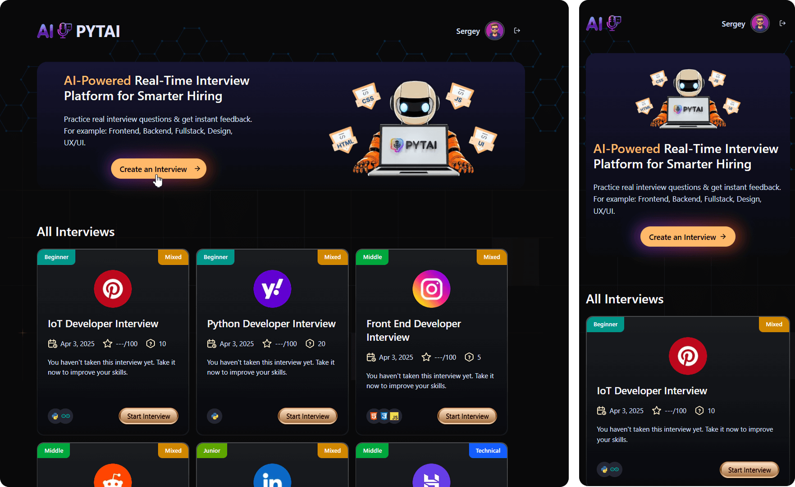
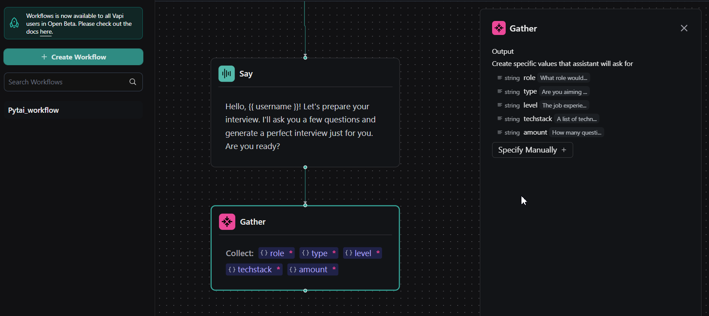

# AI-Powered Real-Time Interview Platform

<div align="center">
  
</div>

## Overview

**Pytai** is an intelligent voice-driven interview platform that helps companies assess candidates in real time using conversational AI. The platform enables automated, consistent, and scalable interviews with dynamic questioning, real-time voice interaction, and comprehensive candidate scoring.

[](https://pytai.space/)

By simulating realistic interview scenarios, Pytai helps:
- **Candidates** practice and improve their interview skills
- **Recruiters** standardize their assessment process
- **Companies** make more informed hiring decisions

## ⭐ Key Features

- **AI-Powered Interviews**: Dynamic voice-based interviews with natural conversation flow
- **Real-Time Feedback**: Instant evaluation of candidate responses
- **Role-Specific Questions**: Tailored interviews for different positions and seniority levels
- **Technology Stack Specialization**: Interviews customized for specific tech stacks
- **Comprehensive Scoring**: Detailed feedback across multiple assessment categories
- **Secure Authentication**: Email verification and account management
- **Interview History**: Track and review past interviews and performance metrics
- **Responsive design**: Fully responsive design that works seamlessly across devices.

## Technologies Used

- **Frontend**: Next.js, React, TypeScript
- **Styling**: Tailwind CSS
- **Authentication**: [Firebase](https://firebase.google.com/) Authentication
- **Database**: Firebase Firestore
- **AI Integration**: 
  - [Google Gemini AI](https://aistudio.google.com/) for response analysis
  - [Vapi](https://vapi.ai/) for voice interaction
  - [AI SDK](https://sdk.vercel.ai/) by Vercel
- **Form Handling**: React Hook Form with Zod validation
- **UI Components**: Custom components with Radix UI primitives
- **Notifications**: Sonner toast notifications

## Getting Started

### Prerequisites

- Node.js 18+ and npm
- Firebase account with Firestore and Authentication enabled
- API keys for Google Gemini and Vapi



### Installation

1. Clone the repository:

```bash
git clone https://github.com/getFrontend/app-ai-interviews.git
cd app-ai-interviews
```

2. Install dependencies:

```bash
npm install
```

3. Set up environment variables:
   Create a `.env.local` file in the root directory with the following variables:

```
# Firebase
NEXT_PUBLIC_FIREBASE_API_KEY=your_firebase_api_key
NEXT_PUBLIC_FIREBASE_AUTH_DOMAIN=your_firebase_auth_domain
NEXT_PUBLIC_FIREBASE_PROJECT_ID=your_firebase_project_id
NEXT_PUBLIC_FIREBASE_STORAGE_BUCKET=your_firebase_storage_bucket
NEXT_PUBLIC_FIREBASE_MESSAGING_SENDER_ID=your_firebase_messaging_sender_id
NEXT_PUBLIC_FIREBASE_APP_ID=your_firebase_app_id

# Google AI
GOOGLE_API_KEY=your_google_api_key

# Vapi
VAPI_API_KEY=your_vapi_api_key
```

4. Start the development server:

```bash
npm run dev
```

5. Open [http://localhost:3000](http://localhost:3000) with your browser to see the application.

## Project Structure

```
app-ai-interviews/
├── app/                  # Next.js app directory
│   ├── (auth)/           # Authentication routes
│   ├── (root)/           # Main application routes
│   ├── api/              # API routes
│   └── layout.tsx        # Root layout
├── components/           # React components
│   ├── auth/             # Authentication components
│   ├── ui/               # UI components
│   └── ...               # Other components
├── constants/            # Application constants
├── firebase/             # Firebase configuration
├── lib/                  # Utility functions and server actions
│   ├── actions/          # Server actions
│   └── utils.ts          # Helper functions
├── public/               # Static assets
└── types/                # TypeScript type definitions
```

## AI Voice Integration

Pytai uses a sophisticated AI voice integration system:

1. The `Agent` component initializes the voice interface and manages the conversation
2. Interview questions are dynamically generated based on the selected role and tech stack
3. The AI processes candidate responses in real-time using natural language understanding
4. Voice transcription converts spoken answers to text for analysis
5. The system evaluates responses using Google's Gemini AI model
6. Comprehensive feedback is generated based on the entire interview transcript

## How to Customize or Extend

### Adding New Interview Types

1. Extend the interview types in `constants/index.ts`
2. Update the interview generation prompt in `app/api/vapi/generate/route.ts`
3. Add any new UI components needed for the interview type

### Customizing Feedback Categories

1. Modify the feedback schema in `constants/index.ts`
2. Update the feedback generation prompt in `lib/actions/general.action.ts`

### Adding New Tech Stacks

1. Add new tech stack icons to the `public` directory
2. Update the tech stack mappings in `constants/index.ts`
3. Ensure the AI prompt templates include knowledge of the new tech stack

## ↘️ Deployment

This application can be easily deployed to Vercel:

1. Push your code to a GitHub repository
2. Import the project in Vercel
3. Configure the environment variables
4. Deploy

## 🔮 Future Improvements

- Multi-language support for global candidates
- Video interview capabilities
- Integration with ATS (Applicant Tracking Systems)
- Enhanced analytics dashboard for recruiters
- Customizable interview templates for different industries
- Mobile application for on-the-go interview practice

## ✌️ Contributing

Contributions are welcome! Please feel free to submit a Pull Request.

1. Fork the repository
2. Create your feature branch (`git checkout -b feature/amazing-feature`)
3. Commit your changes (`git commit -m 'Add some amazing feature'`)
4. Push to the branch (`git push origin feature/amazing-feature`)
5. Open a Pull Request

## License

[MIT License](LICENSE) - Feel free to use and modify this project for your needs.

------------

Built with ❤️ using [JSMastery](https://www.youtube.com/@javascriptmastery/videos), Next.js 15, Vapi AI and Google Gemini

© 2025 Pytai AI by Sergey. All rights reserved.</p>

